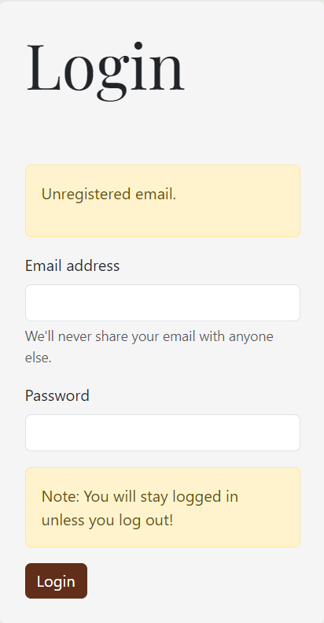

# Responsive Sign Up / Login System
> **Completed for INET 2005 Assignment 2**
>
> Lauren MacDonald, November 2023
>
> **Languages**: Focused on PHP. HTML, CSS (Bootstrap framework), JavaScript used for website.
## Background:
- The user login and registration represent vital functionality that any e-commerce or social media-based website needs.
### Requirements:
This assignment demonstrates the following concepts for evaluation:
- **Common Sign Up/Login functionality**: database setup, registration and login forms (HTML/CSS), registration and
  login PHP scripts, logout functionality.
- **PHP, MySQL, HTML, CSS, Bootstrap, JS**
- **Responsive web pages for different devices**
- **Reusable components**
- **Create feasible business logic**

## How to Use
### XAMPP
This program is set up to connect with MySQL and can be used with XAMPP to access the server. To download XAMPP: https://www.apachefriends.org/
Follow the installation and set up instructions.

### Creating the database and table for this program
Two php files under the xamppSQL directory can be run to establish the database and table needed for this program.
- Run createDB.php first to create the coffeeclub database. Nothing needs to be changed in these files for the set up to work, leave as it
- Once the database successfully created, run the createTable.php to create the users table.

### Access the website
Go to Welcome.php and run the page. If the server is running you should see the webpage successfully.

## Actual Assignment:

### Program Summary:

1. Start on WelcomePage.php
2. User presented with login or sign up options
3. SignUp.php page allows for user input and implements input validation
4. Once successful, information sent to database and user presented with SignUpSuccess.php and can now Login
5. Login.php allows for user input and implements input validation
6. Once successful, information is sent to database, session is started to store information regarding the current login
7. User will stay logged in until they choose to log out.
8. Session variables are used to ensure that someone who is not logged in cannot access logged in specific information

### Screenshot Examples:
#### WelcomePage.php

Javascript is used in the current offer section on the bottom half of the page to display a new offer when the user
clicks on the next or previous button.

#### SignUp.php - Input Validation

Example of user input validation is shown here. The other input validation that will be flagged are:
- If the email is not a valid format.
- The password does not match requirements (8 characters, at least 1 letter and 1 number)
- If the email is already used

#### SignUpSuccess.html

### Login.php

Example of user input validation is shown here. If the email is not in the system, cannot log in and will be presented
with appropriate error. Other input validation are:
- If the email is not a valid format
- If the password is incorrect
- If any of the fields are blank

### Index.php

Once successfully logged in, user is brought to the index page.

### Welcome.php - Logged In

If the session variables are set to logged in, the welcome page changes as well.

### logout.php
If the user selects log out, the session is cleared and the user is returned to the original Welcome page

